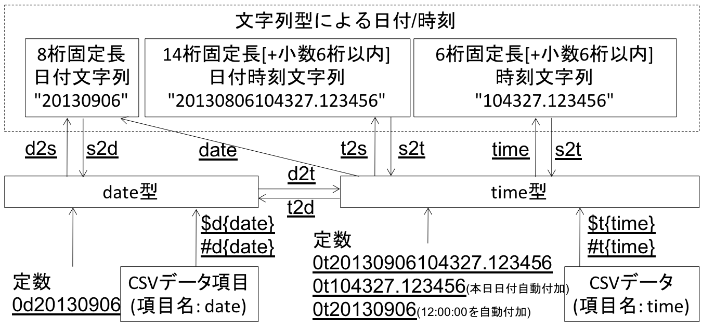

項目間演算
==================

``mcal`` と ``msel`` は項目間の演算を行うことを主目的に開発された処理メソッドある。
項目間演算として100 以上の関数/演算子が実装されており、
それらを組み合わせることで多様な処理を実現できるようになっている。

式の構成要素
------------------

項目間演算で記述する式を構成する要素は、定数、項目値、演算子、関数の4つに大きく分類できる。
そして、それぞれの要素において、ユーザはデータ型を意識して利用する必要がある。
mcmdの処理メソッドではデータは全て文字列として与えらており、
それら文字列を 項目間演算 でどのようなデータ型として扱うかはユーザに委ねられているからである。
項目間演算で扱えるデータ型は文字列型(str),数値型(num)、日付型(date)、時刻型(time)、論理型(bool)の5つである。
以下では、式を構成するそれぞれの要素で、5つのデータ型をどのように扱うかを示す。

定数
------------------

.. csv-table:: 定数の書式一覧
  :header-rows: 1
  :name: None

  データ型,書式,内容,例
  数値( :math:`num` ),整数、実数の文字列表記,内部的には全て倍精度実数を利用,``20  0.55  1.5*e10``
  文字列( :math:`str` ),"文字列",ダブルクオーテーションで括った文字列,``"abc" "日本語"``
  日付( :math:`date` ),0dyyyymmdd,先頭に"0d"を付けた年月日固定長,``0d20080923``
  時刻( :math:`time` ),0tyyyymmddHHMMSS,先頭に"0t"を付けた年月日時分秒固定長,``0t20080923121115``
   ,0tHHMMSS,先頭に"0t"を付けた時分秒固定長(内部的に本日の日付が補完される),``0t121115``
  論理( :math:`bool` ),0b1  0b0,先頭に"0b"を付けた"1"(true)もしくは"0"(false),``0b1  0b0``

項目値
------------------

データ上の項目名を指定するには :numref:`mcal_fld` に示される通り、
データをどのデータ型として扱うかによって異なってくる。
データは全て文字列データであるために、それらをどのような型のデータとして扱うかはユーザの判断に任されている。

.. csv-table:: 項目値の書式一覧
  :header-rows: 1
  :name: mcal_fld

  データ型,書式,CSVデータ内容,例
  数値(num)  ,${項目名},整数、実数(指数表現含む) の文字列表記, ``${amount}``
  文字列(str),$s{項目名},文字列, ``$s{gender}``
  日付(date) ,$d{項目名},年月日固定長(yyyymmdd), ``$d{date}``
  時刻(time) ,$t{項目名},年月日時分秒の固定長(yyyymmddHHMMSS), ``$t{time}``
             , ,時分秒(HHMMSS)の固定長(内部的に本日の日付が補完される),
  論理(bool) ,$b{項目名},項目値の一文字目が"1"の時にtrue、"0"の時にfalse、その他の場合にはNULLと解釈される。, ``$b{condition}``

項目名にはワイルドカードを指定することができる。
例えばsum関数は複数の数値項目の合計を計算する関数であるが、
ワイルドカードを指定することで、多数の項目を一つのワイルドカードで指定することも可能となる。
例えば、入力データとして ``A1,A2,A3`` の3つの数値項目名があったとすると、
``sum(${A*})`` とすれば、 ``A1,A2,A3`` の合計値を計算してくれる。
``sum(${A*},${B*})`` のように複数のワイルドカードを指定することも可能である。

前行の項目値
------------------

項目値の指定に ``$`` の代わりに ``#`` を指定すると、前行の項目値となる。
ただし、先頭行は前行がないのでNULLとなる。
各データ型における指定方法を :numref:`mcal_prev` に示す。

.. csv-table:: 前行の項目値の書式一覧
  :header-rows: 1
  :name: mcal_prev

  データ型,書式,例
  数値(num)  ,#{項目名} , ``#{amount}``
  文字列(str),#s{項目名}, ``#s{gender}``
  日付(date) ,#d{項目名}, ``#d{date}``
  時刻(time) ,#t{項目名}, ``#d{time}``
  論理(bool) ,#b{項目名}, ``#b{condition}``

前行の結果項目値
----------------------------

前行項目の指定において項目名を省略すると前行の計算結果項目の値となる。
各データ型における指定方法を :numref:`mcal_prev_rsl` に示す。
if関数とtop()関数とを組み合わせる事で、累計計算などが可能となる。
以下に、金額項目の累計計算例を示す。

``mcal c='if(top(),${price},${price}+#{})' a=accum``

.. csv-table:: 前行の結果項目値の書式一覧
  :header-rows: 1
  :name: mcal_prev_rsl

  データ型,書式,例
  数値(num)  ,#{} , ``#{}``
  文字列(str),#s{}, ``#s{}``
  日付(date) ,#d{}, ``#d{}``
  時刻(time) ,#t{}, ``#d{}``
  論理(bool) ,#b{}, ``#b{}``

算術演算子
----------------------------

``+`` や ``=True`` などの算術演算子は数値型だけでなく、文字列型や日付型のデータに対しても定義されている。
それらの一覧を :numref:`mcal_ope` に示す。

.. csv-table:: 算術演算子一覧
  :header-rows: 1
  :name: mcal_ope

  演算子,書式,内容,例
  加算(+), :math:`num_1+num_2` ,数値の足し算,``1.5+2.3 (3.8)``
  , :math:`str_1+str_2` ,文字列の結合,``"150"+"円" ("150円")``
  , :math:`date+num` , :math:`num` 日後の日付,``0d20121130+2 (0d20121202)``
  , :math:`time+num` , :math:`num` 秒後の時刻,``0t095959+2 (0t100001)``
  減算(-), :math:`num_1-num_2` ,数値の引き算,``1.5-2.3 (-1.8)``
  , :math:`str_1-str_2` ,部分文字列の削除,``"aababa"-"a"``  ( ``"bb"`` )
  ,,(貪欲マッチによる),``"aababa"-"aba"``  ( ``"aba"`` )
  , :math:`date-num` , :math:`num` 日前の日付,``0d20121202-2 (0d20121130)``
  , :math:`time-num` , :math:`num` 秒前の時刻,``0t100001-2 (0t095959)``
  , :math:`date_1-date_2` ,日付差,``0d20121202-0d20121130 (2)``
  , :math:`time_1-time_2` ,時刻差,``0t095959-0t100001 (-2)``
  乗算(*), :math:`num_1*num_2` ,掛け算,``10*2 (20)``
  除算(/), :math:`num_1/num_2` ,割り算,``10/2 (5)``
  剰余(\%), :math:`num_1\%num_2` ,剰余,``10%3 (1)``
  累乗(\^{}), :math:`num_1` \^{} :math:`num_2` ,累乗,``10^3 (1000)``

比較演算子
----------------------------

比較演算は同一のデータ型の値同士でのみ適用可能である。
全てのデータ型に共通した書式であり、以下では数値型についてのみ(例では文字型につても) :numref:`mcal_ope_comp` に示す。
文字型、日付型、時刻型においても同様に利用できる。

.. csv-table:: 比較演算子一覧
  :header-rows: 1
  :name: mcal_ope_comp

  比較内容,書式,例
  等しい, :math:`num_1==num_2` ,``1.5==1.5(0b1)  "abc"=="abcd" (0b0)``
  等しくない, :math:`num_1!=num_2` ,``1.5!=1.5(0b0)  "abc"=="abcd" (0b1)``
  より大きい, :math:`num_1>num_2` ,``10>5(0b1)  "abc">"abcd" (0b0)``
  より小さい, :math:`num_1<num_2` ,``10<5(0b0)  "abc"<"abcd" (0b1)``
  以上, :math:`num_1>=num_2` ,``10>=10(0b1)  "a">"" (0b1)``
  以下, :math:`num_1<=num_2` ,``8<=9(0b1)  "a"<="a" (0b1)``

論理演算子
----------------------------

3つの論理演算子(論理積、論理和、排他的論理和)が利用でき、それぞれの書式を :numref:`mcal_bool` に示す。
また、それぞれの演算における真偽(1:真,0:偽)の組み合せとその結果を :numref:`mcal_and` , :numref:`mcal_or` , :numref:`mcal_xor` に示す。

.. csv-table:: 論理演算子一覧
  :header-rows: 1
  :name: mcal_bool

  内容,書式,例
  論理積      , :math:`bool_1` && :math:`bool_2` , ``"abc"=="abc" && "xyz"=="abc" (0b0)``
  論理和      , :math:`bool_1` || :math:`bool_2` , ``"abc"=="abc" || "xyz"=="abc" (0b1)``
  排他的論理和, :math:`bool_1` ^^ :math:`bool_2` , ``"abc"=="abc" ^^ "xyz"=="abc" (0b1)``

.. csv-table:: 論理積
  :header-rows: 1
  :name: mcal_and

  :math:`bool_1` , :math:`bool_2` ,結果
  1,1,1
  1,0,0
  0,1,0
  0,0,0
  null,1,null
  null,0,0
  null,null,null

.. csv-table:: 論理和
  :header-rows: 1
  :name: mcal_or

  :math:`bool_1` , :math:`bool_2` ,結果
  1,1,1
  1,0,1
  0,1,1
  0,0,0
  null,1,1
  null,0,null
  null,null,null

.. csv-table:: 排他的論理和
  :header-rows: 1
  :name: mcal_xor

  :math:`bool_1` , :math:`bool_2` ,結果
  1,1,0
  1,0,1
  0,1,1
  0,0,0
  null,1,null
  null,0,null
  null,null,null

演算子(後述)の優先順位は :numref:`mcal_pri_ope` に示すとおりである。
同一の演算子間の優先順位は出現順序による。
優先順位を変更するときは括弧を利用すれば良い。

.. csv-table:: 演算子の優先順位
  :header-rows: 1
  :name: mcal_pri_ope

  優先順位,演算子
  1,``*`` ``/`` ``%`` ``^``
  2,``+`` ``-``
  3,``>`` ``<`` ``>=`` ``<=``
  4,``==`` ``!=``
  5, ``&&``
  6,``||`` ``^^``

関数
----------------

以下では、数値関連( :numref:`mcal_num` )、三角関数関連( :numref:`mcal_sankaku` )、
文字列関連( :numref:`mcal_char` )、正規表現関連( :numref:`mcal_regex` )、
日付時間関連( :numref:`mcal_date` )、論理関数( :numref:`mcal_logical` )、
行/項目情報関連( :numref:`mcal_line` )、NULL値関連( :numref:`mcal_null` )、
そして型変換関連( :numref:`mcal_cast` )の9つに分けて解説する。

.. csv-table:: 数値関連関数一覧
  :header-rows: 1
  :name: mcal_num

  関数名,パラメータ,出力型
  :doc:`methods/func_sum` ,sum( :math:`num_1 num_2 \cdots` ), :math:`num`
  :doc:`methods/func_avg` ,avg( :math:`num_1 num_2 \cdots` ), :math:`num`
  :doc:`methods/func_sqsum` ,sqsum( :math:`num_1 num_2 \cdots` ), :math:`num`
  :doc:`methods/func_min` ,min( :math:`num_1 num_2 \cdots` ), :math:`num`
  :doc:`methods/func_max` ,max( :math:`num_1 num_2 \cdots` ), :math:`num`
  :doc:`methods/func_product` ,product( :math:`num_1 num_2 \cdots` ), :math:`num`
  :doc:`methods/func_factorial` ,factorial( :math:`num` ), :math:`num`
  :doc:`methods/func_gcd` ,gcd( :math:`num_1`   :math:`num_2` ), :math:`num`
  :doc:`methods/func_lcm` ,lcm( :math:`num_1`   :math:`num_2` ), :math:`num`
  :doc:`methods/func_sqrt` ,sqrt( :math:`num` ), :math:`num`
  :doc:`methods/func_abs` ,abs( :math:`num` ), :math:`num`
  :doc:`methods/func_sign` ,sign( :math:`num` ), :math:`num`
  :doc:`methods/func_int` ,int( :math:`num` ), :math:`num`
  :doc:`methods/func_fract` ,fract( :math:`num` ), :math:`num`
  :doc:`methods/func_round` ,round( :math:`num`  基準値), :math:`num`
  :doc:`methods/func_floor` ,floor( :math:`num` ，基準値), :math:`num`
  :doc:`methods/func_ceil` ,ceil( :math:`num` ，基準値), :math:`num`
  :doc:`methods/func_power` ,power( :math:`num` ，指数), :math:`num`
  :doc:`methods/func_exp` ,exp( :math:`num` ), :math:`num`
  :doc:`methods/func_log` ,log( :math:`num` ，底), :math:`num`
  :doc:`methods/func_ln` ,ln( :math:`num` ), :math:`num`
  :doc:`methods/func_log2` ,log2( :math:`num` ), :math:`num`
  :doc:`methods/func_log10` ,log10( :math:`num` ), :math:`num`
  :doc:`methods/func_dist` ,dist(タイプ  :math:`num_1 num_2 \cdots` ), :math:`num`
  :doc:`methods/func_distgps` ,distgps(緯度1 経度1 緯度2 経度2), :math:`num`
  :doc:`methods/func_heron` ,heron( :math:`num_1 num_2 \cdots` ), :math:`num`
  :doc:`methods/func_rand` ,rand([乱数の種]), :math:`num`
  :doc:`methods/func_randi` ,randi(最小値  最大値[  乱数の種]), :math:`num`
  :doc:`methods/func_nrand` ,nrand(平均  標準偏差[  乱数の種]), :math:`num`
  :doc:`methods/func_pi` ,pi(), :math:`num`
  :doc:`methods/func_e` ,e(), :math:`num`
  :doc:`methods/func_format` ,format(), :math:`str`

.. csv-table:: 三角関数関連関数一覧
  :header-rows: 1
  :name: mcal_sankaku

  関数名,パラメータ,出力範囲
  :doc:`methods/func_acos` ,acos( :math:`num` ), :math:`0\sim\pi`
  :doc:`methods/func_asin` ,asin( :math:`num` ), :math:`-\pi\sim\pi`
  :doc:`methods/func_atan` ,atan( :math:`num` ), :math:`-\pi\sim\pi`
  :doc:`methods/func_atan2` ,atan2( :math:`num_1`   :math:`num_2` ), :math:`-\pi\sim\pi`
  :doc:`methods/func_cos` ,cos( :math:`r` ), :math:`-1.0\sim 1.0`
  :doc:`methods/func_sin` ,sin( :math:`r` ), :math:`-1.0\sim 1.0`
  :doc:`methods/func_tan` ,tan( :math:`r` ), :math:`-\infty\sim\infty`
  :doc:`methods/func_degree` ,degree( :math:`r` ), :math:`-\pi\sim\pi`
  :doc:`methods/func_radian` ,radian(角度), :math:`-\pi\sim\pi`
  :doc:`methods/func_cosh` ,cosh( :math:`r` ), :math:`0\sim\infty`
  :doc:`methods/func_sinh` ,sinh( :math:`r` ), :math:`-\infty\sim\infty`
  :doc:`methods/func_tanh` ,tanh( :math:`r` ), :math:`-1.0\sim 1.0`

.. csv-table:: 文字列関連関数一覧
  :header-rows: 1
  :name: mcal_char

  関数名,パラメータ,出力型
  :doc:`methods/func_cat` ,cat( :math:`token  str_1  str_2  \cdots` ), :math:`str`
  :doc:`methods/func_length` ,length( :math:`str` ), :math:`num`
  :doc:`methods/func_fixlen` ,fixlen( :math:`str`   長さ  位置  padding文字), :math:`str`
  :doc:`methods/func_right` ,right( :math:`str`  長さ), :math:`str`
  :doc:`methods/func_left` ,left( :math:`str`  長さ), :math:`str`
  :doc:`methods/func_mid` ,mid( :math:`str`   開始位置  長さ), :math:`str`
  :doc:`methods/func_toupper` ,toupper( :math:`str` ), :math:`str`
  :doc:`methods/func_tolower` ,tolower( :math:`str` ), :math:`str`
  :doc:`methods/func_capitalize` ,capitalize( :math:`str` ), :math:`str`
  :doc:`methods/func_match` ,match(検索文字列  :math:`str_1 str_2 \cdots` ), :math:`bool`
  :doc:`methods/func_hasspace` ,hasspace( :math:`str` ), :math:`bool`

.. csv-table:: 正規表現関連関数一覧
  :header-rows: 1
  :name: mcal_regex

  関数名,パラメータ,出力型
  :doc:`methods/func_regexm` ,regexm( :math:`str`  正規表現), :math:`bool`
  :doc:`methods/func_regexs` ,regexs( :math:`str`  正規表現), :math:`bool`
  :doc:`methods/func_regexrep` ,regexrep( :math:`str`  正規表現 置換文字列), :math:`str`
  :doc:`methods/func_regexlen` ,regexlen( :math:`str`  正規表現), :math:`num`
  :doc:`methods/func_regexpos` ,regexpos( :math:`str`  正規表現), :math:`num`
  :doc:`methods/func_regexstr` ,regexstr( :math:`str`  正規表現), :math:`str`
  :doc:`methods/func_regexpfx` ,regexpfx( :math:`str`  正規表現), :math:`str`
  :doc:`methods/func_regexsfx` ,regexsfx( :math:`str`  正規表現), :math:`str`

.. csv-table:: 日付時間関連関数一覧
  :header-rows: 1
  :name: mcal_date

  関数名,パラメータ,出力型
  :doc:`methods/func_today` ,today(), :math:`date`
  :doc:`methods/func_now` ,now(), :math:`time`
  :doc:`methods/func_tseconds` ,tseconds( :math:`time` ), :math:`num`
  :doc:`methods/func_leapyear` ,leapyear( :math:`dt` ), :math:`bool`
  :doc:`methods/func_year` ,year( :math:`dt` ), :math:`num`
  :doc:`methods/func_month` ,month( :math:`dt` ), :math:`num`
  :doc:`methods/func_day` ,day( :math:`dt` ), :math:`num`
  :doc:`methods/func_week` ,week( :math:`dt` ), :math:`num`
  :doc:`methods/func_dow` ,dow( :math:`dt` ), :math:`num`
  :doc:`methods/func_time` ,time( :math:`time` ), :math:`str`
  :doc:`methods/func_date` ,date( :math:`time` ), :math:`str`
  :doc:`methods/func_hour` ,hour( :math:`time` ), :math:`num`
  :doc:`methods/func_minute` ,minute( :math:`time` ), :math:`num`
  :doc:`methods/func_second` ,second( :math:`time` ), :math:`num`
  :doc:`methods/func_age` ,age( :math:`dt_1 dt_2` ), :math:`num`
  :doc:`methods/func_diff` ,diff( :math:`dt_1 dt_2` ), :math:`num`
  :doc:`methods/func_uxt` ,uxt( :math:`dt` ), :math:`num` (UNIX時刻)
  :doc:`methods/func_julian` ,julian( :math:`dt` ), :math:`num` (ユリウス通日)

.. csv-table:: 論理関連関数一覧
  :header-rows: 1
  :name: mcal_logical

  関数名,パラメータ,出力型
  :doc:`methods/func_and` ,and( :math:`bool_1 bool_2 \cdots)` , :math:`bool`
  :doc:`methods/func_or` ,or( :math:`bool_1 bool_2 \cdots)` , :math:`bool`
  :doc:`methods/func_not` ,not( :math:`bool)` , :math:`bool`
  :doc:`methods/func_if` ,if( :math:`bool num_1 num_2` ), :math:`num`
  :doc:`methods/func_if` ,if( :math:`bool str_1 str_2` ), :math:`str`
  :doc:`methods/func_if` ,if( :math:`bool date_1 date_2)` , :math:`date`
  :doc:`methods/func_if` ,if( :math:`bool time_1 time_2)` , :math:`time`

.. csv-table:: 行/項目情報関連関数一覧
  :header-rows: 1
  :name: mcal_line

  関数名,パラメータ,出力型
  :doc:`methods/func_line` ,line(), :math:`num`
  :doc:`methods/func_top` ,top(), :math:`bool`
  :doc:`methods/func_bottom` ,bottom(), :math:`bool`
  :doc:`methods/func_fldsize` ,fldsize(), :math:`num`
  :doc:`methods/func_argsize` ,argsize( :math:`str_1 str_2 \cdots` ), :math:`num`

.. csv-table:: NULL値関連関数一覧
  :header-rows: 1
  :name: mcal_null

  関数名,パラメータ,出力型
  :doc:`methods/func_null` ,nulln(), :math:`num`
  :doc:`methods/func_null` ,nulls(), :math:`str`
  :doc:`methods/func_null` ,nulld(), :math:`date`
  :doc:`methods/func_null` ,nullt(), :math:`time`
  :doc:`methods/func_null` ,nullb(), :math:`bool`
  :doc:`methods/func_isnull` ,isnull( :math:`num` ), :math:`bool`
  :doc:`methods/func_isnull` ,isnull( :math:`str` ), :math:`bool`
  :doc:`methods/func_isnull` ,isnull( :math:`date` ), :math:`bool`
  :doc:`methods/func_isnull` ,isnull( :math:`time` ), :math:`bool`
  :doc:`methods/func_isnull` ,isnull( :math:`bool` ), :math:`bool`
  :doc:`methods/func_countnull` ,countnull( :math:`num_1 num_2 \cdots` ), :math:`num`
  :doc:`methods/func_countnull` ,countnull( :math:`str_1 str_2 \cdots` ), :math:`num`
  :doc:`methods/func_countnull` ,countnull( :math:`date_1 date_2 \cdots` ), :math:`num`
  :doc:`methods/func_countnull` ,countnull( :math:`time_1 time_2 \cdots` ), :math:`num`
  :doc:`methods/func_countnull` ,countnull( :math:`bool_1 bool_2 \cdots` ), :math:`num`

.. csv-table:: 型変換関連関数一覧
  :header-rows: 1
  :name: mcal_cast

  :doc:`methods/func_cast` , :math:`num` , :math:`str` , :math:`date` , :math:`time` , :math:`bool`
  :math:`num` ,,n2s( :math:`num` ),,,n2b( :math:`num` )
  :math:`str` ,s2n( :math:`str` ),,s2d( :math:`str` ),s2t( :math:`str` ),s2b( :math:`str` )
  :math:`date` ,,d2s( :math:`date` ),,d2t( :math:`date` ),
  :math:`time` ,,t2s( :math:`time` ),t2d( :math:`time` ),,
  :math:`bool` ,b2n( :math:`bool` ),b2s( :math:`bool` ),,,

日付型と時刻型について
-------------------------------

mcalでは日付時刻について2つの型を用意している。
一つは日付型で他方は時刻型である。
時刻型は時刻だけでなく日付とセットで表現する。
内部的にはグレゴリオ暦に基づいたboost C++ライブラリのdate_timeライブラリを利用しており、
日付型にはboost::gregorian::dateクラスを、
時刻型にはboost::posix\_time::ptimeクラスを使っている。
詳細は http://www.boost.org/ のドキュメントを参照されたい。

dateクラスは32ビット整数で管理されており、1400年1月1日から9999年12月31日の範囲をサポートしている。
日付の演算は全てグレゴリオ暦に基づいたものとなっている。
不正な日付(例えば、2013/2/29や1399/12/31)が与えられたときはNULL値が出力される。
一方でptimeクラスは、64ビットで管理されており、ミリ秒まで扱える時刻システムであるが、
mcalコマンドにおいてはミリ秒を扱うインターフェースは備えていない。
またptimeクラスはdateクラスも内部で参照しており、日付をまたいだ時間計算を可能としている。
不正な時刻(例えば、18:62:11)が与えられたときはNULL値が出力される。

mcmdはテキストデータを扱うので、日付/時刻は、データ上は文字列で表現される必要がある。
それらの文字列を日付型および時刻型に内部で変換して各種演算を行い、最終結果を再度文字列に戻して出力している。
文字列のフォーマットは、日付型は8桁固定長文字列(例えば、 ``20130911`` )、
時刻型は14桁固定長文字列(例えば、 ``20130911110528`` )、
もしくは6桁固定長文字列(例えば、 ``110528`` )を標準としている。
日付型と時刻型と各種関数の関係を :numref:`calsel_datetime.png` に示す。
2013年9月6日10時43分27秒を例に、date型とtime型と各種関数の関係を図示している。
実線で囲われたボックスは実データを表し、アンダーラインを付したものは関数等を表している。

  日付型と時刻型と各種関数の関係

またユーザは日付/時刻として固定長文字列を標準とせずに、
ユリウス通日(紀元前4713年1月1日正午からの日数)やUNIX時刻(1970年1月1日00時00分00秒(GMT)からの
経過秒数)などの整数を標準の日時の表記として利用してもよいであろう。
ユリウス通日やUNIX時刻と、日付型/時刻型との変換関数も備えており、十分に運用可能である。
ただし、mcalが提供する日付/時刻関数を使う限りにおいては、内部的にはグレゴリオ暦によって管理されており、
その範囲は、1400年1月1日から9999年12月31日に限定されることに注意する。
またUNIX時刻は32ビット整数で管理されているため、2038年1月19日3時14分7秒を超えると正しく計算できないことに注意する。
ただユリウス通日やUNIX時刻を利用する欠点は、その数字を見ただけでは実際にいつの日付時刻なのか理解出来ない点にあろう。

