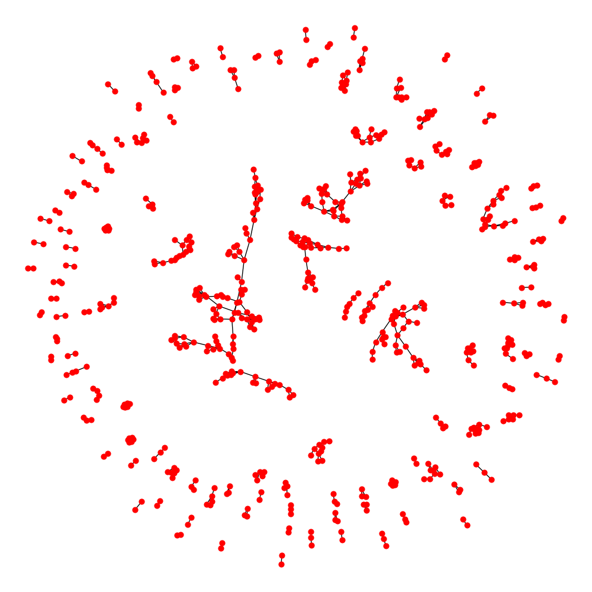

Takeのベンチマークテスト(FIT2018)
================================================================

`FIT2018 <https://www.ipsj.or.jp/event/fit/fit2018/>`_ に発表した原稿 [#f1]_
に掲載されたTakeパッケージの利用方法に関するスクリプトについて説明する。
そこでは3つのスクリプトが掲載されており、ランク情報に基づく相関ルール分析、バイクラスタリング、
そして、:doc:`Take <../take>` と |Orange3a| のベンチマークテストに関するものである。
いずれもデータとして「 |uci_onlineretail| 」を利用している。

.. |uci_onlineretail| raw:: html

  <a href="https://archive.ics.uci.edu/ml/datasets/online+retail" target="_blank">online retailデータセット</a>

   
準備
-------------------------------------
本節で扱っているPythonスクリプトの全ては `github <https://github.com/nysol/bench>`_ よりダウンロードできる。
ただし、既に「 :doc:`mcmd_fit2018` 」の節を実行済みであれば、同じものなのでダウンロードの必要はない。
ダウンロードしたディレクトリ下 bench/fit2018/nysol_take に 以下の4つのスクリプトがある。

 * mkdata.py : online retailデータセットのダウンロードとデータクリーニング用スクリプト
 * bench.py : Orange3とのベンチマーク用スクリプト( :numref:`take_fit2018_bench` )
 * friends.py : 原稿のfig.1に示されたランク情報に基づいた2アイテム相関ルールの視覚化のスクリプト( :numref:`take_fit2018_fig1` )
 * bicluster.py : 原稿のfig.3に示されたバイクラスタリングのスクリプト( :numref:`take_fit2018_fig3` )

.. code-block:: bash
  :linenos:
  :caption: ベンチマークスクリプトのダウンロード
  :name: take_fit2018_download

  $ git clone https://github.com/nysol/bench.git
  $ cd bench/fit2018/nysol_take
 

takeベンチマークテスト(vs. Orange3)
-------------------------------------
nysol.takeの処理速度を評価するにあたって、Pythonで利用可能なデータマイニングモジュール
|orange3a| をベンチマークとする速度比較テストを実施した。
Orange3-associateモジュールは、機械学習のパッケージ |orange3| のアドオンパッケージであり、
Orange3のインストールも必要となる。

.. |orange3a| raw:: html

  <a href="https://github.com/biolab/orange3-associate" target="_blank">Orange3-associate</a>

.. |orange3| raw:: html

  <a href="https://github.com/biolab/orange3/" target="_blank">Orange3</a>

利用データ
''''''''''''''''''''''''''''''''''''
利用したデータは、「 :doc:`../dataset/uci_onlineretail` 」節で解説されている
オンラインストアの購買履歴データである。
上述のgitからダウンロードしたスクリプト ``mkdata.py`` を実行すれば、
DATAディレクトリの下にデータが生成される( :numref:`take_fit2018_datarun` )。
20〜30分ほど時間を要する。
基本データの生成は直ぐに終わるが、ベンチマークテストのために、基本データを定数倍したデータを生成している。
これは、単に基本データをそのまま定数回コピーして作成するのではなく、
トランザクション毎に30%ほどのアイテムをランダムに入れ替える処理を行っており、
その作業に20〜30分の時間を要する。
データは :numref:`take_fit2018_sample` に例示されるような8項目の54万行ほどのデータである。

  .. code-block:: bash
    :linenos:
    :caption: オンラインストア購買履歴データの取得スクリプトの実行
    :name: take_fit2018_datarun

    $ ./mkdata.py 
    downloading original dataset...
    reading xlsx...
    writing xlsx as tsv...
    #END# kgtab2csv i=./DATA/onlineRetail.tsv o=./DATA/online_all.csv; IN=541910 OUT=541909; 2018/09/15 13:41:52; 2018/09/15 13:41:52
    #END# kgcut f=InvoiceNo,StockCode i=./DATA/online_all.csv; IN=541909 OUT=541909; 2018/09/15 13:41:52; 2018/09/15 13:41:52
    #END# kguniq k=InvoiceNo,StockCode; IN=541909 OUT=531225; 2018/09/15 13:41:52; 2018/09/15 13:41:52
    #END# kgfldname -q o=./DATA/onlineM_all.csv; IN=531225 OUT=531225; 2018/09/15 13:41:52; 2018/09/15 13:41:52
    #END# kgcut f=StockCode i=./DATA/online_all.csv; IN=541909 OUT=541909; 2018/09/15 13:41:52; 2018/09/15 13:41:52
    #END# kguniq k=StockCode; IN=541909 OUT=4070; 2018/09/15 13:41:52; 2018/09/15 13:41:52
    #END# kgnumber a=num s=StockCode; IN=4070 OUT=4070; 2018/09/15 13:41:52; 2018/09/15 13:41:52
    #END# kgjoin f=num i=./DATA/online_all.csv k=StockCode; IN=541909 OUT=541909; 2018/09/15 13:41:53; 2018/09/15 13:41:53
    #END# kgcut f=InvoiceNo,num:StockCode; IN=541909 OUT=541909; 2018/09/15 13:41:53; 2018/09/15 13:41:53
    #END# kgtra f=StockCode k=InvoiceNo; IN=541909 OUT=25900; 2018/09/15 13:41:53; 2018/09/15 13:41:53
    #END# kgcut -nfno f=StockCode o=./DATA/onlineT_all.csv; IN=25900 OUT=25900; 2018/09/15 13:41:53; 2018/09/15 13:41:53
    START enlarge 10
    0
    1
    :
    START enlarge 100
    0
    1
    :
    START enlarge 1000
    0
    1
    :
    999

.. code-block:: bash
  :linenos:
  :caption: オンラインストア購買履歴データ
  :name: take_fit2018_sample

  $ head onlineRetail.csv 
  InvoiceNo,StockCode,Description,Quantity,InvoiceDate,UnitPrice,CustomerID,Country
  536365,85123A,WHITE HANGING HEART T-LIGHT HOLDER,6,2010-12-01 08:26:00,2.55,17850.0,United Kingdom
  536365,71053,WHITE METAL LANTERN,6,2010-12-01 08:26:00,3.39,17850.0,United Kingdom
     :     :     :     :

:numref:`take_fit2018_sample` に示されたデータから、
TakeとOrangeの頻出アイテム列挙メソッドで用いるトランザクションデータを作成した。
``InvoiceNo`` を単位に ``StockCode`` をアイテムとするトランザクションデータである。
さらに、アイテム数はそのままに、オリジナルデータに3割のノイズを乗せたデータを追加し、
サイズ違いのデータ(s-10:10倍,s-100:100倍,s-1000:1000倍)を用意した。
トランザクションデータは :numref:`take_fit2018_tra` に示されるように、
行をトランザクションとし、0から始まる整数をアイテム番号としたスペース区切りのデータである。
全データセットのサイズは、 :numref:`take_fit2018_data` に示される通りである。

.. code-block:: bash
  :linenos:
  :caption: トランザクションデータ
  :name: take_fit2018_tra

  $ head onlineO_all.basket
  800,1662,3044,3536,2984,2985,2794
  1547,1546
  3372,817,2770,1659,816,3305,1655,829,1247,1536,1658,1537
  1816,1817,1862,1815
  818
   :

.. list-table:: ベンチマークに用いたデータ一覧
  :header-rows: 1
  :name: take_fit2018_data

  * - 名称
    - トランザクション数
    - item数
    - サイズ
    - 内容
  * - org
    - 25,900
    - 4070
    - 2,559,662
    - オリジナルのデータ
  * - s-10
    - 259,000
    - 4070
    - 25,238,529
    - orgを10倍したデータ
  * - s-100
    - 2,590,000
    - 4,070
    - 252,014,860
    - orgを100倍したデータ
  * - s-1000
    - 25,900,000
    - 4,070
    - 2,519,826,014
    - orgを1000倍したデータ

処理内容
''''''''''''''''''''''''''''''''''''
評価に使ったコードは、 :numref:`take_fit2018_bench` に示される通りである。
頻出アイテム集合の列挙には、
Orange3-associateでは、frequent_itemsetsメソッドを、Takeからはlcmメソッドを利用した。
計測結果は、 ``OUTPUT/bench/bench_5.txt`` に出力される。
TakeのcoreメソッドのTakeのlcmはOrangeのfrequent_itemsetに比べて、
3-4倍高速であることがわかる。

.. code-block:: python
  :linenos:
  :caption: ベンチマークスクリプト
  :name: take_fit2018_bench

  #!/usr/bin/env python
  # -*- coding: utf-8 -*-/
  import os
  import sys
  import time
  from pprint import pprint

  import nysol.take.extcore as ntc
  import Orange
  from orangecontrib.associate.fpgrowth import *

  loop=5

  iPath=root="./DATA"
  oPath=root="./OUTPUTS/bench"
  os.system("mkdir -p %s"%(oPath))
  oFile="%s/bench_%d.txt"%(oPath,loop)

  # takeの頻出アイテム列挙メソッドlcmの実行
  def L1(iFile,minFreq):
	  ntc.lcm(type="Ff",sup=minFreq,i=iFile,o="xxrsl11")

  # Orange3-associateの頻出アイテム列挙メソッドfrequent_itemsetsの実行
  def O1(iFile,minFreq):
	  tbl = Orange.data.Table(iFile)
	  X, mapping = OneHot.encode(tbl)
	  itemsets =frequent_itemsets(X, minFreq)

  sec={}
  mean={}
  params=[]

  params.append(["L1" ,   1,"%s/onlineT_all.csv"%iPath])
  params.append(["O1" ,   1,"%s/onlineO_all.basket"%iPath])
  params.append(["L1" ,  10,"%s/onlineT_size10.csv"%iPath])
  params.append(["O1" ,  10,"%s/onlineO_size10.basket"%iPath])
  params.append(["L1" , 100,"%s/onlineT_size100.csv"%iPath])
  params.append(["O1" , 100,"%s/onlineO_size100.basket"%iPath])
  params.append(["L1" ,1000,"%s/onlineT_size1000.csv"%iPath])
  params.append(["O1" ,1000,"%s/onlineO_size1000.basket"%iPath])

  for param in params:
	  func   =param[0]
	  size   =param[1]
	  iFile  =param[2]
	  minFreq=size*100
	  name="%s_%d"%(func,size)
	  print("START:",name)
	  sec[name]=[]
	  for i in range(loop):
		  st=time.time()
		  eval(func+'("%s",%d)'%(iFile,minFreq))
		  sec[name].append(time.time()-st)
	  mean[name]=0
	  for i in range(loop):
		  mean[name]+=sec[name][i]
	  mean[name]/=loop
  
  print("write to: ",oFile)
  with open(oFile, "w") as file:
	  pprint(sys.argv[0], stream=file)
	  pprint(loop, stream=file)
	  pprint(sec, stream=file)
	  pprint(mean, stream=file)

結果
''''''''''''''''''''''''''''''''''''
出力結果をまとめたものを :numref:`take_fit2018_bench_result` に示している。
defは :numref:`take_fit2018_bench` の関数名を表す。
org,s-10,s-100,s-1000は :numref:`take_fit2018_data` に示したサイズ別データセットの名称である。

.. csv-table:: ベンチマークの結果(単位:秒)。
  :name: take_fit2018_bench_result
  :header: program,def,org,s-10,s-100,s-1000

  Take.lcm                 ,L1 , 0.269, 1.427, 19.39,250.3
  Orange.frequent_itemsets ,O1 , 0.569, 5.598, 58.72,778.4

ベンチマークテストを実施した計算環境は以下の通りである。

 * PC: MacPro(2013)
 * CPU: 2.7GHz 12-Core Intel Xeon E5
 * memory: 64GB
 * hdd: USB3 HDD

.. note::

  ここ以降の内容は、近い将来「 :doc:`../tutorial/index` 」の節に移動します。

ランク情報に基づく相関ルール分析
-----------------------------------------------
相関ルール分析は、データマイニングの分野で代表的な分析手法で、
特にルールを高速に列挙する技術は飛躍的な進展を遂げてきた。
しかしながら、パラメータの設定次第では時に大量のルールが出力され、
そこから興味深いルールを抽出するまでにユーザに多大な負担を強いることも少なくない。

この問題を解決する一つの方法として相互ランク情報に基づいたルールの抽出方法が提案されている [#f2]_ 。
Takeモジュールでは、 ``mfriends`` 及び ``mpal`` メソッドとして実装されている。
この手法の特徴は、相関ルール列挙において2アイテムルール :math:`A=>B(|A|=1,|B|=1)` のみを列挙し、
そこから :math:`A,B` 相互に関連の強いルールを選択するというものである。
:math:`A=>B` 及び :math:`B=>A` の評価指標(supportやconfidence)が、それぞれの前件部を共通としてもつルール集合の中で
ユーザが指定した k 位以内であるとき、アイテム集合 :math:`A` と :math:`B` の関連が強いと考える。
:numref:`take_fit2018_fig1` は、OnlineStoreのデータから、そのようなルールを列挙するPythonコードである。
そして、グラフで視覚化した結果を :numref:`friends.png` に示す。
赤い節点が一つのアイテムを示し、エッジが関連の強い結びつきを表している。

.. code-block:: python
  :linenos:
  :caption: ルールの相互ランク情報に基づいた2アイテム相関ルールの列挙とその可視化を実現するスクリプト
  :name: take_fit2018_fig1

  #!/usr/bin/env python
  # -*- coding: utf-8 -*-/
  import os
  import networkx as nx

  import matplotlib
  matplotlib.use('Agg') # 追加
  import matplotlib.pyplot as plt

  import nysol.mcmd as nm
  import nysol.take as nt
  from nysol.util.margs import Margs

  iFile=("./DATA/online_all.csv")
  oPath=("./OUTPUTS/friends")
  os.system("mkdir -p %s"%oPath)

  # Make a similarity graph of StockCode: frequent 2-itemset enumeration

  # iFile
  # InvoiceNo,StockCode,Description,Quantity,InvoiceDate,UnitPrice,CustomerID,Country
  # 536365,85123A,WHITE HANGING HEART T-LIGHT HOLDER,6,2010/12/1 8:26,2.55,17850,United Kingdom
  # 536365,71053,WHITE METAL LANTERN,6,2010/12/1 8:26,3.39,17850,United Kingdom
  f=None
  f <<= nm.mcut(f="InvoiceNo,StockCode",i=iFile)
  f <<= nm.muniq(k="InvoiceNo,StockCode",o="%s/tra.csv"%oPath)
  f.run(msg="on")

  nt.mitemset(S=100,tid="InvoiceNo",item="StockCode",l=2,u=2,i="%s/tra.csv"%oPath,O=oPath).run()

  # patterns.csv
  # pid,size,count,total,support%0nr,lift,pattern
  # 86,2,833,25900,0.03216216216,8.209,22386 85099B
  # 501,2,784,25900,0.03027027027,17.1523,22697 22699
  # 129,2,733,25900,0.0283011583,7.4039,21931 85099B

  # Filitering the friend pairs of StockCode in the similarity graph of StockCode.
  f=None
  f <<= nm.msplit(f="pattern",a="item1,item2",i="%s/patterns.csv"%oPath)
  f <<= nm.mcut(f="item1,item2,lift",o="%s/rules.csv"%oPath)
  f.run(msg="on")

  nt.mfriends(ef="item1,item2",ei="%s/rules.csv"%oPath,sim="lift", rank=5, udout=True, eo="%s/friends.csv"%oPath).run()

  # visualization of the graph
  f=None
  f <<= nm.mcal(c="cat(\" \",$s{item1},$s{item2})", a="edges", i="%s/friends.csv"%oPath)
  f <<= nm.mcut(f="edges",nfno=True,o="%s/edges.csv"%oPath)
  f.run(msg="on")

  G = nx.read_edgelist("%s/edges.csv"%oPath)
  pos=nx.spring_layout(G)
  plt.figure(figsize=(10, 10))
  nx.draw(G, pos=pos,node_size=40,iterations=20)

  plt.savefig("%s/friends.png"%oPath)

  :numref:`take_fit2018_fig1` の実行結果

バイクラスタリング
-----------------------------------------------
顧客 :math:`v\in V` が商品 :math:`u\in U` を一定数以上購入していた時に枝を :math:`(v,u)\in E` を張るようような二部グラフ :math:`G=(V\cup U,E)`
について、枝が密に貼られている２つの部の部分集合
を抽出することで、
商品の購入パターンが似た顧客集合を得ることができる。
これはバイクラスタリングと呼ばれる手法である。
:math:`G` 上の密な部分集合の定義としては、極大二部クリーク [#f4]_
を用いることができるが、
現実のデータにおいては例外的な接続関係が多く含まれるために、何の工夫もなければ、
多数のクリークが列挙されることとなり、
元のデータを小数のグループで表現するというクラスタリングの目的が損なわれてしまう。
そこで、与えられた二部グラフ :math:`G` を「研磨(polish)」することで、
元の性質をできる限り失わずに、劇的にクラスタの数を削減する方法が提案されている [#f3]_ 。
Takeでは、そのような研磨処理は ``mbipolish`` メソッドを利用することで実現できる。
:numref:`take_fit2018_fig3` onlineStoreのデータから顧客と商品の二部グラフを構成し、
それを研磨し極大二部クリークを列挙するPythonコードである。

.. code-block:: python
  :linenos:
  :caption: ルールの相互ランク情報に基づいた2アイテム相関ルールの列挙とその可視化を実現するスクリプト
  :name: take_fit2018_fig3

  #!/usr/bin/env python
  # -*- coding: utf-8 -*-/
  import os
  import nysol.mcmd as nm
  import nysol.take as nt

  iFile=("./DATA/online_all.csv")
  oPath=("./OUTPUTS/bicluster")
  os.system("mkdir -p %s"%oPath)

  # 購入回数が5回以上の商品-顧客のペアを選択することで二部グラフを構成する。
  f=None
  f <<= nm.mcut(f="StockCode,CustomerID",i=iFile)
  f <<= nm.mdelnull(f="StockCode,CustomerID")
  f <<= nm.mcount(k="StockCode,CustomerID",a="freq")
  f <<= nm.mselnum(f="freq",c='[5,]',o="%s/bipartiteGraph.csv"%oPath)
  f.run()
  # bipartiteGraph.csvの内容
  # StockCode%0,CustomerID%1,freq
  # 10125,12731,5
  # 10133,12748,5
  # 10135,14096,11
  # 11001,14096,7

  # 二部クリークの列挙
  # 出力項目StockCode,CustomerIDはベクトル型で出力されており、それぞれのサイズがsize1,size2項目
  nt.mbiclique(ei="%s/bipartiteGraph.csv"%oPath, ef="StockCode,CustomerID", o="%s/clique_non-polish.csv"%oPath).run()
  # clique_non-polish.csvの内容
  # StockCode%0,CustomerID%1,size1,size2
  # 10125 20682 20685 ... 90119 90166 CRUK DOT,14096,453,1
  # 15036,12748 12841 12877 12971 13089 13098 14060 16186 16700,1,9
  # 15036 15044D 20723 22355 22502 22661,12877,6,1
  #                     :

  # 二部グラフの研磨を行う。出力も二部グラフとなる。
  nt.mbipolish(ei="%s/bipartiteGraph.csv"%oPath, ef="StockCode,CustomerID", sim="R", th=0.3, eo="%s/bipartiteGraphPolish.csv"%oPath).run( )
  # bipartiteGraphPolish.csvの内容
  # StockCode,CustomerID
  # 10133,12748
  # 10135,14096
  # 11001,14096
  #      :

  # 研磨された二部グラフから鈍くリークを列挙する。
  nt.mbiclique(ei="%s/bipartiteGraphPolish.csv"%oPath,ef="StockCode,CustomerID", o="%s/clique_polish.csv"%oPath).run()
  # clique_polish.csvの内容
  # StockCode%0,CustomerID%1,size1,size2
  # 15056BL 15056N 20679,15854,3,1
  # 16011 20975 22440,17596,3,1
  # 16014 16015 16016 22300,18077,4,1
  # 16161U,17365,1,1
  #          :

  # 研磨なしの二部クリークのサイズ別件数(size2:顧客のサイズのみを示してる)
  f=None
  f <<= nm.mchgnum(f="size2",R="1,3,5,7,9,11,21,31,41,51,MAX",v="1-2,3-4,5-6,7-8,9-10,11-20,21-30,31-40,41-50,51-",i="%s/clique_non-polish.csv"%oPath)
  f <<= nm.mcut(f="size2")
  f <<= nm.mcount(k="size2",a="freq",o="%s/hist_non-polish.csv"%oPath)
  f.run(meg="on")
  # hist_non-polish.csvの内容
  # size2%0,freq
  # 1-2,2636
  # 11-20,1512
  # 21-30,140
  # 3-4,9027
  # 31-40,31
  # 41-50,11
  # 5-6,6682
  # 51-,12
  # 7-8,3156
  # 9-10,1501

  # 研磨ありの二部クリークのサイズ別件数(size2:顧客のサイズのみを示してる)
  f=None
  f <<= nm.mchgnum(f="size2",R="1,3,5,7,9,11,21,31,41,51,MAX",v="1-2,3-4,5-6,7-8,9-10,11-20,21-30,31-40,41-50,51-",i="%s/clique_polish.csv"%oPath)
  f <<= nm.mcut(f="size2")
  f <<= nm.mcount(k="size2",a="freq",o="%s/hist_polish.csv"%oPath)
  f.run(meg="on")
  # hist_polish.csvの内容
  # size2%0,freq
  # 1-2,205
  # 11-20,6
  # 3-4,31
  # 5-6,17
  # 7-8,4
  # 9-10,2

.. rubric:: Footnotes

.. [#f1] 羽室行信,宇野毅明,中元政一,中原孝信,丸橋弘明,「 Take: Pythonにおけるデータマイニング支援ツール」FIT2018:第17回情報科学技術フォーラム,2018/9/20,福岡工業大学.

.. [#f2] 岩﨑幸子,中元政一,中原孝信,宇野毅明,羽室行信,グラフ構造による相関ルールの視覚化ツール：KIZUNA,2017年度人工知能学会(第31回),ウインクあいち,2017/5/24.

.. [#f3] 中原孝信, 大内章子, 宇野毅明, 羽室行信, 「データ研磨の2部グラフへの適用と Twitter からの意見抽出」,2016年度人工知能学会（第30回）,北九州国際会議場, 2016.6.6〜6.9.

.. [#f4] :math:`U,V` の部分集合によって誘導される部分グラフの部間の任意の節点に枝があるような :math:`G` の誘導部分グラフを二部クリークと呼び、ある二部クリークが他の二部クリークの真部分集合でなければ、それは極大二部クリークと呼ばれる。

