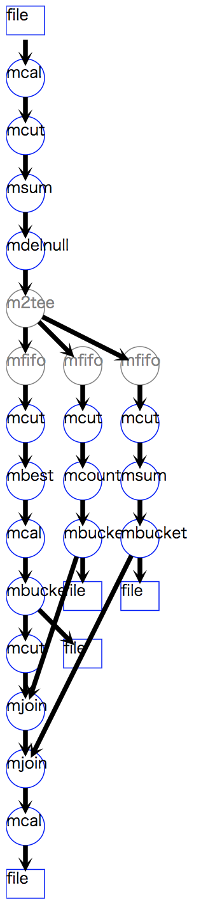

RFM分析
------------------------
本節ではonline storeのデータセットを用いて、|rfm| をおこなう方法について解説する。
|rfm| は、マーケティングの分野で用いられる顧客セグメンテーションの一手法である。
以下に示すRecency(最新購入日)、Frequency(購入頻度)、
Monetary(購入金額)の3軸によって顧客を分類し、
それぞれの分類に適したマーケティング施策を実施しようというものである。

* Recency: ある基準日から最新購入日までの日数をスコア化したもの。
* Frequency: 一定期間に何回の来店があったか、その回数をスコア化したもの。
* Monetary: 一定期間に購入した総金額をスコア化したもの。

.. |rfm| raw:: html

  <a href="https://en.wikipedia.org/wiki/RFM_(customer_value)" target="_blank">RFM分析</a>

RFMの各軸は、1〜5もしくは1〜10(高いスコアがよい顧客)
にスコア化されることが多いが、特に定まった方法があるわけではない(このチュートリアルでは1〜3を用いている)。
また、RFMの各軸の区切り方には様々な方法が考えられる。
例えば、お得意の顧客は少なくとも1週間に1度は来店するという経験則があれば、
最新購入日の区切りを1週間,2週間,...と定めるかもしれない。
このような経験則は業種や業態によって異なってくるであろう。
数理的な方法を用いるのであれば、最大値と最小値の幅(range)を均等に分割する方法や
順位を均等に分割する方法などが考えられる。
rangeで分割すると、異常値があった場合によい分割ができない(例えば1点ばかりに集中するなど)ことになるかもしれない。
以下の例ではランクを均等に分割することでスコアリングする方法を紹介する。

入力データと出力データ
'''''''''''''''''''''''''''''''''
:numref:`tutorial_rfm_input_image` に本課題で利用する入力データ ``onlineRetail2.csv`` 
のサンプルを示している。
このファイルは、 :doc:`../../dataset/uci_onlineretail` で作成したデータセットである。
カレントディレクトリにコピーしておこう。
RFM分析を進めるにあたって必要となる項目は、
顧客IDの ``CustomerID`` 、RecencyとFrequencyを計算するための ``date`` 、
そして、Monetaryを計算するための ``UnitPrice`` と ``Quantity`` である。

.. csv-table:: online retailデータセット
  :name: tutorial_rfm_input_image
  :header: InvoiceNo,StockCode,Description,Quantity,UnitPrice,CustomerID,Country,date,time

  536365,85123A,WHITE HANGING HEART T-LIGHT HOLDER,6,2.55,17850,United Kingdom,20101201,082600
  536365,71053 ,WHITE METAL LANTERN               ,6,3.39,17850,United Kingdom,20101201,082600
  536365,84406B,CREAM CUPID HEARTS COAT HANGER    ,8,2.75,17850,United Kingdom,20101201,082600
    :   ,  :   ,               :                  ,:,  : ,  :  ,       :      ,    :   ,  :

:numref:`tutorial_rfm_output_image` には出力データイメージを示している。
顧客別にRFMそれぞれのスコアを項目 ``R`` ``F`` ``M`` として出力し、
それらの合計点を ``score`` として計算したものである。

.. csv-table:: RFM分析の出力イメージ
  :name: tutorial_rfm_output_image
  :header: CustomerID,R,F,M,score

  12347,5,2,4,11
  12348,2,2,1,5
  12349,2,4,3,9
    :   :

スクリプト
''''''''''''''''''''''''''
RFM分析のスクリプトを :numref:`tutorial_rfm_scp` に示す。
まず最初に ``base`` 変数に 入力データからRFMの計算で必要となる共通項目を作成している(13-17行目)。
R,F,Mのそれぞれで入力データ ``onlineRetail2.csv`` から計算してもよいが、
ここで共通の処理を行っているのには2つの理由があり、
同じ処理を3度実行するより計算効率が高まることと、
同じ処理をまとめることでメンテナンス性が高まることである。
ここでは、入力データ全てを対象としているが、直近の1年間のみを選択したり、
分析対象商品を購入したことのある顧客に絞ったりするなどの処理は、
このブロックに追記すればよい。

19-31行目のRecencyの計算では、まず ``mstats`` メソッドで入力データの最新日を取得している。
これは日付を数値とみなし、最大値を得ることで実現できる。
``mstats`` では ``o=`` を指定していないので、結果はPythonの2重リスト ``[["20111209"]]`` に格納される。
そして、その日付(20111209)を基準にして、 ``mcal`` によって日数計算を行っている。
``mcal`` のパラメータである ``c="0d%s-$d{date}"%latestDate[0][0]`` の ``%s`` を展開すると
``c="0d20111209-$d{date}"`` となる。
mcmdの内部では、データは全て文字列として扱われるため、
``mcal`` では、定数や項目を日付型として扱うことを指定しなければならない。
``0d`` で始まる書式が定数を日付型として指定する方法であり、
``$d{date}`` のように ``$d`` で始まり括弧で項目名を囲うのが、項目を日付型として指定する方法である。
詳細は、「 :doc:`../mcmd/calsel` 」の節を参照されたい。

そして最後に ``mbucket`` により、計算された基準日からの日数により顧客を3分割している。
このメソッドでは、顧客を日数の小さい順に並べ替え、
できる限り顧客数が均等になるような日数の分割ポイントを計算し、
順番に1,2,3のグループ番号を割り当てている。
ただしここでは、 ``r=True`` が指定されているので、逆順に3,2,1の分類番号を付与される。
すなわち、直近に来店している良い顧客はグループ番号3が付与され、
逆にしばら来店していない問題のある顧客は1が付与される。
その値をそのままRecencyのスコア( ``R`` 項目)として用いている。

Frequency(33-37行)は、 ``CustomerID`` の件数を数えることで、来店した合計日数が計算されている。
来店日数ではなく、買い物の回数でFrequencyを定義したければ、
日付の代わりに入力データの ``InvoiceNo`` 項目を用いればよい。
Monetary(39-43行)は、 ``amount`` 項目を合計することで計算される。

FrequencyもMonetaryも、値が大きいほど良い顧客であると考えるので、
``mbucket`` では ``r=True`` を指定せず、値が大きいほど大きなグループ番号を割り当て、R,Mのスコアとしている。

そして最後に、R,F,Mのスコアを合計した ``score`` 項目を作成している。
R,F,M全てが3の顧客が最も優良な顧客グループでscore=9となり、全てが1の顧客が最低スコアの3となる。
このスコアは、優良顧客の分類モデルや回帰モデルの目的変数として利用することができるであろう。

以上の処理フローを視覚化するメソッド ``drawModelD3`` を53行目に入れている。
また、R,F,Mの人数分布とscoreの人数分布を55〜79行目で計算している。

.. code-block:: python
  :linenos:
  :caption: RFM分析のスクリプト
  :name: tutorial_rfm_scp

  #!/usr/bin/env python
  # -*- coding: utf-8 -*- 
  from pprint import pprint
  import nysol.mcmd as nm
  
  # onlineRetail2.csv
  # InvoiceNo,StockCode,Description,Quantity,UnitPrice,CustomerID,Country,date,time
  # 536365,85123A,WHITE HANGING HEART T-LIGHT HOLDER,6,2.55,17850,United Kingdom,20101201,082600
  # 536365,71053,WHITE METAL LANTERN,6,3.39,17850,United Kingdom,20101201,082600
  # 536365,84406B,CREAM CUPID HEARTS COAT HANGER,8,2.75,17850,United Kingdom,20101201,082600
  
  # select the fields used in the following scripts
  base=None
  base <<= nm.mcal(c="${UnitPrice}*${Quantity}", a="amount", i="onlineRetail2.csv")
  base <<= nm.mcut(f="CustomerID,date,amount")
  base <<= nm.msum(k="CustomerID,date", f="amount")
  base <<= nm.mdelnull(f="*")
  
  # recency
  f=None
  f <<= nm.mcut(f="date", i=base)
  f <<= nm.mstats(f="date",c="max")
  latestDate=f.run()
  print(latestDate)
  # [['20111209']]
  
  recency=None
  recency <<= nm.mcut(f="CustomerID,date", i=base)
  recency <<= nm.mbest(k="CustomerID", s="date%r")
  recency <<= nm.mcal(c="0d%s-$d{date}"%latestDate[0][0], a="recency")
  recency <<= nm.mbucket(f="recency:R" ,n=3 ,O="r_range.csv")
  
  # frequency
  frequency=None
  frequency <<= nm.mcut(f="CustomerID", i=base)
  frequency <<= nm.mcount(k="CustomerID", a="frequency")
  frequency <<= nm.mbucket(f="frequency:F" ,n=3 ,O="f_range.csv", r=True)
  
  # monetary
  monetary=None
  monetary <<= nm.mcut(f="CustomerID,amount", i=base)
  monetary <<= nm.msum(k="CustomerID", f="amount:monetary")
  monetary <<= nm.mbucket(f="monetary:M" ,n=3 ,O="m_range.csv", r=True)
  
  # join all three fields to one table
  f=None
  f <<= nm.mcut(f="CustomerID,R",i=recency)
  f <<= nm.mjoin(k="CustomerID", m=frequency, f="F", assert_diffSize=True)
  f <<= nm.mjoin(k="CustomerID", m=monetary, f="M", assert_diffSize=True)
  # calculate the loyalty of the cusotmers as a summation of R,F,M, meaning high loyalty as low score.
  f <<= nm.mcal(c="${R}+${F}+${M}", a="score", o="rfm.csv")
  f.run(msg="on")
  f.drawModelD3("rfm.html")
  
  # distribution of the R,F,M score
  dist=None
  dist <<= nm.mcut(f="R,F,M,score", i="rfm.csv")
  dist <<= nm.mcount(k="R,F,M", a="count")
  pprint(dist.run())
  # [['1', '1', '1', '3', '694'],
  #  ['1', '1', '2', '4', '120'],
  #  ['1', '1', '3', '5', '10'],
  #  ['1', '2', '1', '4', '102'],
  #              :
  #  ['3', '3', '2', '8', '143'],
  #  ['3', '3', '3', '9', '663']]
  
  # distribution of socres
  dist=None
  dist <<= nm.mcut(f="score", i="rfm.csv")
  dist <<= nm.mcount(k="score", a="count")
  pprint(dist.run())
  # [['3', '694'],
  #  ['4', '570'],
  #  ['5', '571'],
  #  ['6', '622'],
  #  ['7', '667'],
  #  ['8', '585'],
  #  ['9', '663']]

  

  rfm分析の処理フロー図

